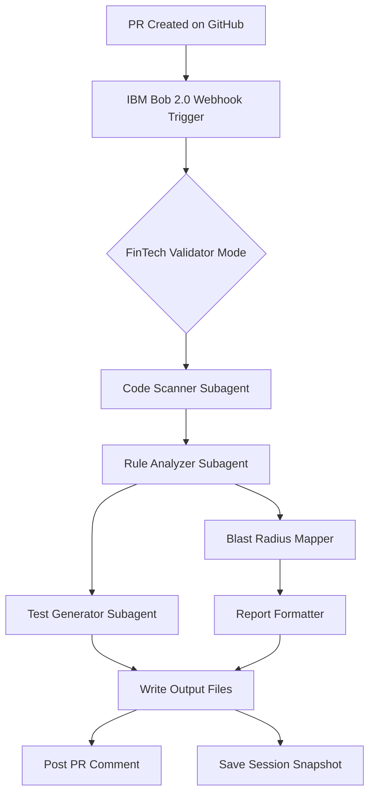
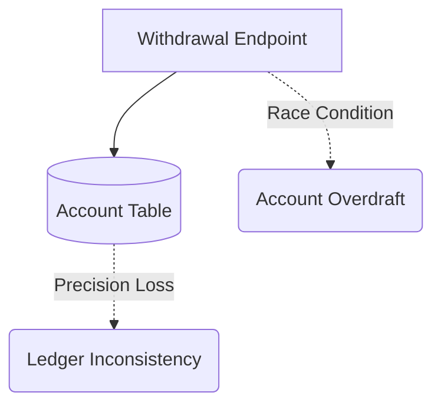

# 🛡️ BlitzDev — FinTech-Aware PR Guardian

> **IBM Bob 2.0 Hackathon** | Track: Code Review & Quality | Team Royal Code

## 🎯 Problem Statement

Standard code review tools and linters catch syntax errors and style violations, but they miss **high-risk financial business logic flaws** that can cause real monetary losses:

- 💸 **Floating-point rounding errors** in currency calculations (IEEE 754 precision loss)
- 🔄 **Missing transaction rollbacks** causing partial transfers and phantom money
- ⚡ **Race conditions on withdrawals** due to missing row-level locks (`SELECT FOR UPDATE`)
- 🔑 **Auth & idempotency gaps** enabling duplicate transactions and unauthorized access

**BlitzDev** is a FinTech-aware PR guardian that catches these domain-specific risks before they reach production.

## 🏗️ Architecture



## 🚀 IBM Bob 2.0 Features Used

| Feature | How BlitzDev Uses It |
|---------|---------------------|
| **Custom Modes** | "FinTech Validator Mode" — specialized financial code review persona |
| **Agent Mode** | Autonomous analysis pipeline: scan → analyze → diagram → format → test-gen |
| **Subagents** | Dedicated subagents for rule checking, blast radius mapping, and test generation |
| **Skills** | Reusable financial pattern detection skills for currency, ACID, concurrency checks |
| **Task Snapshots** | Every analysis run saved to `bob_sessions/` for audit trail and reproducibility |

## 📁 Project Structure

```text
BlitzDev/
├── .bobignore
├── README.md
├── pyproject.toml
├── requirements.txt
├── demo_api/                  # Target test codebase (intentionally flawed)
│   ├── __init__.py
│   ├── database.py            # SQLite + SQLAlchemy async setup
│   ├── models.py              # Account & Transaction ORM models
│   ├── schemas.py             # Pydantic request/response models
│   ├── main.py                # FastAPI endpoints with injected flaws
│   └── seed.py                # Database seeding script
├── blitzdev_agent/            # The AI review engine
│   ├── __init__.py
│   ├── __main__.py            # python -m blitzdev_agent entrypoint
│   ├── main.py                # CLI argument parsing & orchestration
│   ├── rules.py               # FinTech Validator rule definitions
│   ├── analyzer.py            # Static analysis + blast radius mapper
│   ├── formatter.py           # GitHub PR Markdown comment generator
│   ├── test_generator.py      # Automated exploit test generator
│   └── AGENTS.md              # Agent configuration documentation
├── bob_sessions/
│   └── .gitkeep               # IBM Bob 2.0 session snapshots
└── output/
    └── .gitkeep               # Analysis outputs & generated tests
```

## 🛠️ Local Installation

```bash
# Clone the repository
git clone https://github.com/team-royal-code/blitzdev.git
cd blitzdev

# Create virtual environment
python3.11 -m venv .venv
source .venv/bin/activate

# Install dependencies
pip install -r requirements.txt

# Seed the demo database
python -m demo_api.seed

# Start the demo API (optional, for manual testing)
uvicorn demo_api.main:app --reload --port 8000
```

## 🔍 Usage

### Run BlitzDev Analysis
```bash
# Analyze the demo API
python -m blitzdev_agent --repo ./demo_api

# Analyze with PR metadata
python -m blitzdev_agent --repo ./demo_api --pr 42

# JSON output
python -m blitzdev_agent --repo ./demo_api --format json --output ./output
```

### Output Files
- `output/pr_comment.md` — Ready-to-post GitHub PR comment
- `output/analysis.json` — Structured findings data
- `output/generated_tests/test_financial_exploits.py` — Auto-generated exploit tests
- `bob_sessions/session_<timestamp>.json` — Bob 2.0 task execution snapshot

### Run Generated Tests
```bash
pytest output/generated_tests/ -v --tb=short
```

## 📊 Example Output

## 🚨 FinTech Guardian Scan Results

**Status:** ❌ 3 Critical Vulnerabilities Found
**Execution Time:** 4.2s | **Mode:** FinTech Validator

### 💥 High-Risk Findings

#### 1. Floating-Point Precision Loss (FIN-001)
- **File:** `demo_api/routers.py:L45`
- **Issue:** Using `float` for currency calculations (`balance -= amount`). IEEE 754 precision loss can lead to fractional penny discrepancies over time.
- **Fix:** Use Python's `decimal.Decimal` module or store currency as integer cents.

#### 2. Missing Row-Level Locks (FIN-002)
- **File:** `demo_api/routers.py:L50`
- **Issue:** Reading balance and writing new balance in separate steps without a lock. Vulnerable to race conditions where concurrent withdrawals overdraw the account.
- **Fix:** Use `SELECT FOR UPDATE` when fetching the account row before modifying.

### 🌐 Blast Radius Map


## 🏆 Demo Scenario

1. Developer opens a PR adding withdrawal and transfer features to a banking API
2. IBM Bob 2.0 triggers BlitzDev in FinTech Validator Mode
3. BlitzDev detects:
   - 🔴 Float arithmetic for currency (FIN-001)
   - 🔴 No row locking on withdrawals (FIN-002)
   - 🔴 Non-atomic transfers (FIN-003)
   - ⚠️ Missing idempotency validation (FIN-004)
4. Generates a PR comment with blast radius diagram and concrete fix suggestions
5. Auto-generates race condition exploit tests
6. Saves session snapshot for audit compliance

## 📜 License

MIT License — Built for the IBM Bob 2.0 Hackathon on lablab.ai

---

**Team Royal Code** | IBM Bob 2.0 Hackathon | lablab.ai
