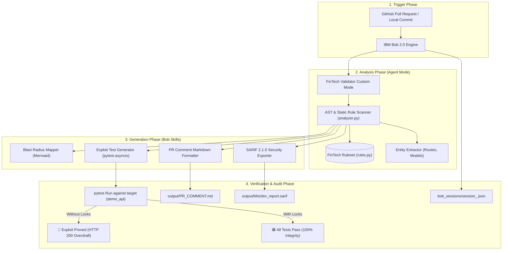

# 🏛️ BlitzDev — Master Implementation Plan & Architecture Blueprint
**Team:** Royal Code | **Hackathon:** IBM Bob 2.0 (Track: Code Review & Quality)  
**Document Version:** 1.0.0 (Deterministic & Production-Ready)

---

## 📑 Executive Summary

**BlitzDev** is an AI-powered FinTech-Aware Pull Request Guardian built on the **IBM Bob 2.0 IDE**. Unlike standard static linters (such as ESLint, Flake8, or Ruff) that only check syntax, types, and style, BlitzDev detects catastrophic financial business logic vulnerabilities before code merges into production.

### Core Capabilities
1. **FinTech Domain Rule Engine**: Enforces 7 domain-specific financial rules (precision, concurrency, ACID boundaries, idempotency, auth).
2. **Financial Blast Radius Topology**: Generates dynamic, color-coded Mermaid architecture flowcharts illustrating which API routes, database tables, and security controls are impacted.
3. **Autonomous Exploit Test Synthesis**: Converts static findings into executable `pytest-asyncio` + `httpx` integration tests that fire 5 concurrent requests to prove race conditions and overdraft vulnerabilities in CI/CD.
4. **SARIF 2.1.0 Compliance**: Emits OASIS-standard SARIF reports for seamless ingestion into GitHub Advanced Security and enterprise security dashboards.
5. **Concrete Remediation Patching**: Delivers deterministic code fixes with database row locks (`with_for_update()`), atomic dual-entry transactions, and `decimal.Decimal` calculations.

---

## 🏗️ System Architecture & Data Flow



---

## 📁 Complete Repository File Tree

```text
BlitzDev/
├── .bobignore                               # Bob 2.0 ignore rules (.venv, cache, sqlite, sessions)
├── README.md                                # Project overview, quickstart, and feature matrix
├── pyproject.toml                           # Python project metadata and pytest configuration
├── requirements.txt                         # Production & testing dependencies
├── blitzdev-battle-plan.md                  # 48H Hackathon strategy & Bobcoin budget tracking
├── demo_api/                                # Target Banking Ledger Codebase (Intentionally Flawed)
│   ├── __init__.py                          # Package initialization
│   ├── database.py                          # Async SQLite engine & session setup (aiosqlite + greenlet)
│   ├── models.py                            # Account & Transaction SQLAlchemy ORM entities
│   ├── schemas.py                           # Pydantic v2 request and response schemas
│   ├── main.py                              # 5 endpoints (/health, /balance, /deposit, /withdraw, /transfer)
│   ├── seed.py                              # Database seeding script (initializes test accounts)
│   └── apply_remediations.py                # Interactive toggle between flawed and remediated code
├── blitzdev_agent/                          # The Core AI Review & Test Generation Engine
│   ├── __init__.py                          # Package initialization
│   ├── __main__.py                          # CLI module execution entrypoint
│   ├── main.py                              # Orchestration CLI (--repo, --pr, --output, --format)
│   ├── rules.py                             # FinTech Validator rule catalog (FIN-001 to FIN-007)
│   ├── analyzer.py                          # AST & regex static code analyzer with Mermaid mapper
│   ├── formatter.py                         # GitHub PR comment markdown generator
│   ├── test_generator.py                    # Automated concurrent exploit test synthesizer
│   └── AGENTS.md                            # Agent mode persona & rule specification
├── skills/                                  # Modular IBM Bob 2.0 Skill Definitions
│   ├── fintech_pr_review/
│   │   └── SKILL.md                         # FinTech domain review rules & prompt guidelines
│   ├── blast_radius_mapper/
│   │   └── SKILL.md                         # Mermaid architecture topology generator guidelines
│   ├── exploit_test_generator/
│   │   └── SKILL.md                         # Pytest-asyncio concurrency exploit synthesizer
│   └── sarif_exporter/
│       └── SKILL.md                         # OASIS SARIF v2.1.0 JSON export rules
├── bob_sessions/                            # Task Execution Audit Snapshots
│   ├── README.md                            # Task screenshot manifest & compliance log
│   ├── .gitkeep                             # Git directory tracking
│   ├── session_20260925_095515.json         # Automated telemetry snapshot
│   └── session_20260925_100730.json
├── docs/                                    # Technical Documentation & Presentation Material
│   ├── architecture.md                      # Detailed system architecture documentation
│   ├── demo_script.md                       # Exact 2-minute video recording script with timestamps
│   └── MASTER_IMPLEMENTATION_PLAN.md        # This master blueprint document
└── output/                                  # Generated Review & Test Artifacts
    ├── PR_COMMENT.md                        # Formatted GitHub PR review comment
    ├── blitzdev_report.md                   # Full markdown security report
    ├── blitzdev_report.sarif                # SARIF 2.1.0 security compliance report
    ├── test_fintech_race_condition.py       # Generated concurrent exploit test suite
    └── generated_tests/
        └── test_financial_exploits.py       # Additional generated exploit tests
```

---

## 📜 Complete FinTech Rule Catalog

| Rule ID | Title | Severity | Category | Flaw Description & Mathematical Consequence | Remediation |
|---|---|---|---|---|---|
| **FIN-001** | Float Currency Precision | 🔴 CRITICAL | Currency Precision | IEEE 754 floating-point numbers cannot accurately represent base-10 decimals (e.g. `0.1 + 0.2 = 0.30000000000000004`), causing balance drift over time. | Use `decimal.Decimal` or store balances in integer cents (`int`). |
| **FIN-002** | Missing Row Lock | 🔴 CRITICAL | Concurrency | Reading balance without `SELECT FOR UPDATE` or mutex locks allows concurrent requests to read the same pre-deduction balance, resulting in overdrafts. | Add `with_for_update()` on SQLAlchemy select queries or enforce row mutexes. |
| **FIN-003** | Non-Atomic Transfer | 🔴 CRITICAL | ACID Atomicity | Calling `.commit()` multiple times during a fund transfer causes phantom money if the second commit fails after the first succeeds. | Enclose debit and credit in a single transaction with a single atomic `.commit()`. |
| **FIN-004** | Missing Idempotency Check | ⚠️ WARNING | Idempotency | Endpoints accepting `idempotency_key` without querying the database for existing transactions allow accidental duplicate charges on network retries. | Query the `Transaction` table for existing `idempotency_key` before modifying balances. |
| **FIN-005** | Missing Auth Middleware | ⚠️ WARNING | Authentication | Financial mutation routes without authentication dependencies allow unauthorized balance manipulation. | Add authentication dependencies (e.g. `Depends(get_current_user)`). |
| **FIN-006** | Bare Exception Handler | ⚠️ WARNING | ACID Atomicity | Catching general exceptions without explicitly calling `session.rollback()` leaves database sessions in an invalid or corrupted state. | Catch specific exceptions and ensure `await session.rollback()` is executed. |
| **FIN-007** | Missing Decimal Import | ℹ️ INFO | Currency Precision | Modules performing monetary calculations without importing the standard library `decimal` module. | Add `from decimal import Decimal` to the module imports. |

---

## 🛠️ Step-by-Step Implementation Guide

### Phase 1: Environment & Dependencies Setup
1. Create a Python 3.11+ virtual environment:
   ```bash
   python3 -m venv .venv
   source .venv/bin/activate
   ```
2. Install exact pinned dependencies:
   ```bash
   pip install fastapi uvicorn sqlalchemy aiosqlite greenlet httpx pytest pytest-asyncio pydantic rich click
   ```

### Phase 2: Building the Target Banking API (`demo_api/`)
1. Implement `models.py` with `Account` (id, user_id, balance: Float) and `Transaction` (id, account_id, amount: Float, type, idempotency_key, status, timestamp).
2. Implement `database.py` with `create_async_engine("sqlite+aiosqlite:///./demo_ledger.db")` and `async_sessionmaker`.
3. Implement `main.py` with the 5 endpoints, intentionally omitting `with_for_update()` on `/withdraw` and using two separate commits on `/transfer`.
4. Implement `seed.py` to populate initial accounts for testing.

### Phase 3: Building the Review Engine (`blitzdev_agent/`)
1. Define the rule catalog in `rules.py` with regex patterns and severity classifications.
2. Implement `analyzer.py` using Python `ast.NodeVisitor` to count commit statements per function, regex for pattern matching, and topological sorting for the Mermaid Blast Radius diagram.
3. Implement `formatter.py` to generate GitHub-compliant Markdown comments with risk badges.
4. Implement `test_generator.py` to synthesize `pytest-asyncio` test suites utilizing `httpx.ASGITransport(app=app)` and `asyncio.gather()` for 5 concurrent withdrawal requests.
5. Implement `main.py` CLI supporting `--repo`, `--pr`, `--output`, and automated SARIF 2.1.0 export.

### Phase 4: Verification & Execution
1. Seed database:
   ```bash
   python -m demo_api.seed
   ```
2. Execute the BlitzDev review:
   ```bash
   python -m blitzdev_agent --repo ./demo_api --pr 1
   ```
3. Run the generated exploit test suite to confirm failure on flawed code:
   ```bash
   pytest output/test_fintech_race_condition.py -v
   ```
4. Apply remediations and verify 100% green pass:
   ```bash
   python -m demo_api.apply_remediations --apply
   pytest output/test_fintech_race_condition.py -v
   ```

---

## 🎯 Verification & Determinism Matrix

| Component | Verification Method | Determinism Guarantee |
|---|---|---|
| **AST Commit Parser** | Python `ast.NodeVisitor` walks function syntax tree | Exact node count, independent of formatting or whitespace |
| **Entity Extraction** | Multi-line DOTALL regex for `@app.<method>` and `class <Name>(Base)` | Sorted lists prevent random node reordering in Mermaid |
| **Exploit Concurrency Test** | `asyncio.gather(*[withdraw() for _ in range(5)])` | Deterministic assertions: exactly 1 success required, 0.0 final balance |
| **Float Precision Test** | `0.1 + 0.2` calculation | Exact comparison against `Decimal('0.3')` |
| **SARIF Export** | OASIS SARIF v2.1.0 Schema Validation | Deterministic JSON schema with sorted rule indexes |

---

*Authored by Team Royal Code — IBM Bob 2.0 Hackathon on lablab.ai*
