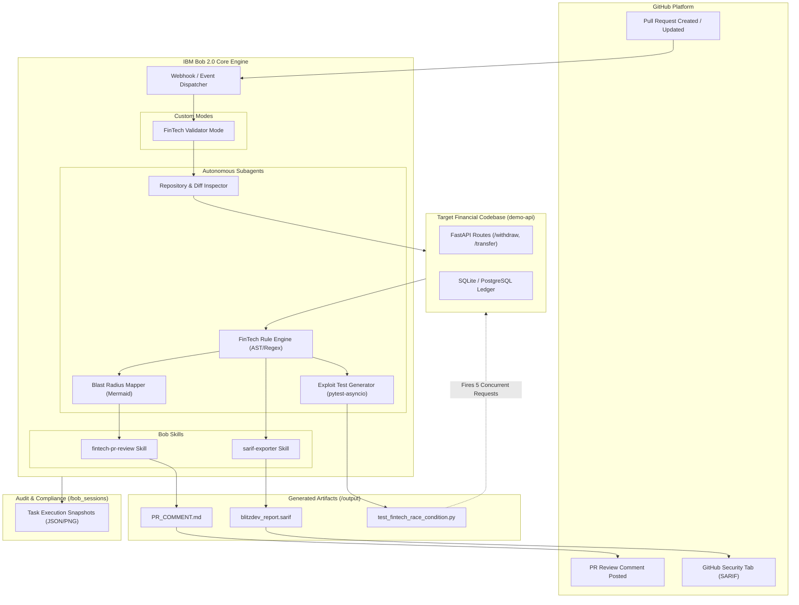

# 🏗️ BlitzDev System Architecture

> **Team Royal Code** | IBM Bob 2.0 Hackathon (Track: Code Review & Quality)

## 📌 High-Level Architecture Overview

BlitzDev is an autonomous FinTech-Aware Pull Request Guardian powered by the **IBM Bob 2.0 IDE**. It intercepts PRs on financial services codebases, executes domain-aware static and AST analysis, maps out the systemic blast radius, and auto-generates exploit test suites that run in CI/CD.

---

## 🧩 Component Breakdown

### 1. FinTech Validator (Custom Mode)
- Configured inside IBM Bob 2.0 with domain-specific rule directives.
- Focuses exclusively on high-risk monetary hazards:
  - **FIN-001**: IEEE 754 Floating-point division and balance storage.
  - **FIN-002**: Missing database row-level locking (`SELECT FOR UPDATE` / `with_for_update()`).
  - **FIN-003**: Non-atomic multi-step transfers lacking unified transaction rollbacks.
  - **FIN-004**: Idempotency key acceptance without stateful duplicate rejection.
  - **FIN-005**: Unauthenticated financial mutation endpoints.
  - **FIN-006**: Bare exceptions swallowing database rollbacks.
  - **FIN-007**: Missing Python `decimal.Decimal` module imports in financial modules.

### 2. Financial Blast Radius Mapper
- Inspects route endpoints and ORM models.
- Generates a Mermaid flowchart highlighting routes, touched tables, and missing critical controls.

### 3. Automated Exploit Test Generator
- Synthesizes runnable `pytest-asyncio` + `httpx` integration tests.
- Simulates race conditions by dispatching 5 concurrent withdrawal requests at an account with exactly $100 balance.
- Validates failure on unpatched code and validates fix passing on patched code.

### 4. SARIF 2.1.0 & PR Formatter
- Emits standard Static Analysis Results Interchange Format (`blitzdev_report.sarif`) for GitHub Advanced Security / code scanning.
- Emits markdown comment (`PR_COMMENT.md`) with visual severity indicators.
