## 🛡️ BlitzDev — FinTech PR Guardian Report
**Scan Summary**: 17 files analyzed, 17 critical, 34 warnings, 7 info.

### 🔴 Critical Financial Risks
**[FIN-001] Float Currency**
- **Location**: `demo_api/schemas.py` at line 6
- **Impact**: Using float for money fields (balance, amount, price, total, fee) can lead to precision errors.
- **Remediation**: Use decimal.Decimal for all monetary values.
```python
   3: 
   4: class AccountCreate(BaseModel):
   5:     user_id: str = Field(..., min_length=1)
>> 6:     initial_balance: float = Field(0.0, ge=0.0)
   7: 
   8: class WithdrawRequest(BaseModel):
   9:     amount: float = Field(..., gt=0.0)
```

**[FIN-001] Float Currency**
- **Location**: `demo_api/schemas.py` at line 9
- **Impact**: Using float for money fields (balance, amount, price, total, fee) can lead to precision errors.
- **Remediation**: Use decimal.Decimal for all monetary values.
```python
   6:     initial_balance: float = Field(0.0, ge=0.0)
   7: 
   8: class WithdrawRequest(BaseModel):
>> 9:     amount: float = Field(..., gt=0.0)
   10:     idempotency_key: Optional[str] = None
   11: 
   12: class TransferRequest(BaseModel):
```

**[FIN-001] Float Currency**
- **Location**: `demo_api/schemas.py` at line 15
- **Impact**: Using float for money fields (balance, amount, price, total, fee) can lead to precision errors.
- **Remediation**: Use decimal.Decimal for all monetary values.
```python
   12: class TransferRequest(BaseModel):
   13:     from_account_id: int
   14:     to_account_id: int
>> 15:     amount: float = Field(..., gt=0.0)
   16:     idempotency_key: Optional[str] = None
   17: 
   18: class DepositRequest(BaseModel):
```

**[FIN-001] Float Currency**
- **Location**: `demo_api/schemas.py` at line 19
- **Impact**: Using float for money fields (balance, amount, price, total, fee) can lead to precision errors.
- **Remediation**: Use decimal.Decimal for all monetary values.
```python
   16:     idempotency_key: Optional[str] = None
   17: 
   18: class DepositRequest(BaseModel):
>> 19:     amount: float = Field(..., gt=0.0)
   20:     idempotency_key: Optional[str] = None
```

**[FIN-001] Float Currency**
- **Location**: `demo_api/seed.py` at line 12
- **Impact**: Using float for money fields (balance, amount, price, total, fee) can lead to precision errors.
- **Remediation**: Use decimal.Decimal for all monetary values.
```python
   9:             await conn.run_sync(Base.metadata.drop_all)
   10:             await conn.run_sync(Base.metadata.create_all)
   11:             
>> 12:         acc1 = Account(id=1, user_id="viraj_primary", balance=100.0)
   13:         acc2 = Account(id=2, user_id="shridhar_receiver", balance=50.0)
   14:         
   15:         session.add_all([acc1, acc2])
```

**[FIN-001] Float Currency**
- **Location**: `demo_api/seed.py` at line 13
- **Impact**: Using float for money fields (balance, amount, price, total, fee) can lead to precision errors.
- **Remediation**: Use decimal.Decimal for all monetary values.
```python
   10:             await conn.run_sync(Base.metadata.create_all)
   11:             
   12:         acc1 = Account(id=1, user_id="viraj_primary", balance=100.0)
>> 13:         acc2 = Account(id=2, user_id="shridhar_receiver", balance=50.0)
   14:         
   15:         session.add_all([acc1, acc2])
   16:         await session.commit()
```

**[FIN-002] Missing Row Lock**
- **Location**: `demo_api/main.py` at line 41
- **Impact**: Missing 'FOR UPDATE' or 'with_for_update' in withdraw/debit patterns.
- **Remediation**: Use with_for_update() in SQLAlchemy when querying balances to update.
```python
   38: 
   39: @app.get("/accounts/{account_id}/balance")
   40: async def get_balance(account_id: int, db: AsyncSession = Depends(get_db)):
>> 41:     result = await db.execute(select(Account).where(Account.id == account_id))
   42:     account = result.scalar_one_or_none()
   43:     if not account:
   44:         raise HTTPException(status_code=404, detail="Account not found")
```

**[FIN-002] Missing Row Lock**
- **Location**: `demo_api/main.py` at line 58
- **Impact**: Missing 'FOR UPDATE' or 'with_for_update' in withdraw/debit patterns.
- **Remediation**: Use with_for_update() in SQLAlchemy when querying balances to update.
```python
   55:                     select(Transaction).where(Transaction.idempotency_key == req.idempotency_key)
   56:                 )
   57:                 if existing_txn.scalar_one_or_none():
>> 58:                     acc_res = await db.execute(select(Account).where(Account.id == account_id))
   59:                     acc = acc_res.scalar_one()
   60:                     return {"message": "Deposit already processed (idempotent replay)", "balance": quantize_amount(acc.balance)}
   61: 
```

**[FIN-002] Missing Row Lock**
- **Location**: `demo_api/main.py` at line 62
- **Impact**: Missing 'FOR UPDATE' or 'with_for_update' in withdraw/debit patterns.
- **Remediation**: Use with_for_update() in SQLAlchemy when querying balances to update.
```python
   59:                     acc = acc_res.scalar_one()
   60:                     return {"message": "Deposit already processed (idempotent replay)", "balance": quantize_amount(acc.balance)}
   61: 
>> 62:             result = await db.execute(select(Account).where(Account.id == account_id))
   63:             account = result.scalar_one_or_none()
   64:             if not account:
   65:                 raise HTTPException(status_code=404, detail="Account not found")
```

**[FIN-002] Missing Row Lock**
- **Location**: `demo_api/main.py` at line 94
- **Impact**: Missing 'FOR UPDATE' or 'with_for_update' in withdraw/debit patterns.
- **Remediation**: Use with_for_update() in SQLAlchemy when querying balances to update.
```python
   91:                     select(Transaction).where(Transaction.idempotency_key == req.idempotency_key)
   92:                 )
   93:                 if existing_txn.scalar_one_or_none():
>> 94:                     acc_res = await db.execute(select(Account).where(Account.id == account_id))
   95:                     acc = acc_res.scalar_one()
   96:                     return {"message": "Withdrawal already processed (idempotent replay)", "new_balance": quantize_amount(acc.balance)}
   97: 
```

**[FIN-002] Missing Row Lock**
- **Location**: `demo_api/main.py` at line 98
- **Impact**: Missing 'FOR UPDATE' or 'with_for_update' in withdraw/debit patterns.
- **Remediation**: Use with_for_update() in SQLAlchemy when querying balances to update.
```python
   95:                     acc = acc_res.scalar_one()
   96:                     return {"message": "Withdrawal already processed (idempotent replay)", "new_balance": quantize_amount(acc.balance)}
   97: 
>> 98:             result = await db.execute(select(Account).where(Account.id == account_id))
   99:             account = result.scalar_one_or_none()
   100:             
   101:             if not account:
```

**[FIN-002] Missing Row Lock**
- **Location**: `demo_api/main.py` at line 146
- **Impact**: Missing 'FOR UPDATE' or 'with_for_update' in withdraw/debit patterns.
- **Remediation**: Use with_for_update() in SQLAlchemy when querying balances to update.
```python
   143:                         select(Transaction).where(Transaction.idempotency_key == req.idempotency_key)
   144:                     )
   145:                     if existing_txn.scalar_one_or_none():
>> 146:                         acc_res = await db.execute(select(Account).where(Account.id == req.from_account_id))
   147:                         acc = acc_res.scalar_one()
   148:                         return {"message": "Transfer already processed (idempotent replay)", "source_balance": quantize_amount(acc.balance)}
   149: 
```

**[FIN-002] Missing Row Lock**
- **Location**: `demo_api/main.py` at line 150
- **Impact**: Missing 'FOR UPDATE' or 'with_for_update' in withdraw/debit patterns.
- **Remediation**: Use with_for_update() in SQLAlchemy when querying balances to update.
```python
   147:                         acc = acc_res.scalar_one()
   148:                         return {"message": "Transfer already processed (idempotent replay)", "source_balance": quantize_amount(acc.balance)}
   149: 
>> 150:                 result_from = await db.execute(select(Account).where(Account.id == req.from_account_id))
   151:                 source_acc = result_from.scalar_one_or_none()
   152:                 
   153:                 result_to = await db.execute(select(Account).where(Account.id == req.to_account_id))
```

**[FIN-002] Missing Row Lock**
- **Location**: `demo_api/main.py` at line 153
- **Impact**: Missing 'FOR UPDATE' or 'with_for_update' in withdraw/debit patterns.
- **Remediation**: Use with_for_update() in SQLAlchemy when querying balances to update.
```python
   150:                 result_from = await db.execute(select(Account).where(Account.id == req.from_account_id))
   151:                 source_acc = result_from.scalar_one_or_none()
   152:                 
>> 153:                 result_to = await db.execute(select(Account).where(Account.id == req.to_account_id))
   154:                 dest_acc = result_to.scalar_one_or_none()
   155:                 
   156:                 if not source_acc or not dest_acc:
```

**[FIN-002] Missing Row Lock**
- **Location**: `tests/test_concurrency_exploit.py` at line 31
- **Impact**: Missing 'FOR UPDATE' or 'with_for_update' in withdraw/debit patterns.
- **Remediation**: Use with_for_update() in SQLAlchemy when querying balances to update.
```python
   28: 
   29:     # 4. Query resulting ledger balance directly from database
   30:     async with async_session() as session:
>> 31:         result = await session.execute(select(Account).where(Account.id == 1))
   32:         account = result.scalar_one()
   33:         final_balance = account.balance
   34: 
```

**[FIN-002] Missing Row Lock**
- **Location**: `tests/test_concurrency_remediated.py` at line 30
- **Impact**: Missing 'FOR UPDATE' or 'with_for_update' in withdraw/debit patterns.
- **Remediation**: Use with_for_update() in SQLAlchemy when querying balances to update.
```python
   27: 
   28:     # 4. Check final ledger balance directly from database
   29:     async with async_session() as session:
>> 30:         result = await session.execute(select(Account).where(Account.id == 1))
   31:         account = result.scalar_one()
   32:         final_balance = float(account.balance)
   33: 
```

**[FIN-002] Missing Row Lock**
- **Location**: `tests/test_concurrency_remediated.py` at line 68
- **Impact**: Missing 'FOR UPDATE' or 'with_for_update' in withdraw/debit patterns.
- **Remediation**: Use with_for_update() in SQLAlchemy when querying balances to update.
```python
   65:         assert "already processed" in res2.json()["message"]
   66: 
   67:     async with async_session() as session:
>> 68:         result = await session.execute(select(Account).where(Account.id == 1))
   69:         account = result.scalar_one()
   70:         # Initial was 100.00, should only be debited ONCE to 75.00
   71:         assert float(account.balance) == 75.0, f"Expected $75.00, got ${account.balance}"
```

### ⚠️ Warnings & Missing Controls
**[FIN-004] Missing Idempotency Check**
- **Location**: `blitzdev_agent/rules.py` at line 73
- **Impact**: Endpoints accepting idempotency_key but not querying for existing keys.
- **Remediation**: Check the database for the idempotency_key before processing the request.
```python
   70:         title="Missing Idempotency Check",
   71:         severity=Severity.WARNING,
   72:         category=Category.IDEMPOTENCY,
>> 73:         description="Endpoints accepting idempotency_key but not querying for existing keys.",
   74:         detection_patterns=[r"idempotency_key(?!\s*.*?query\()"],
   75:         remediation="Check the database for the idempotency_key before processing the request.",
   76:     ),
```

**[FIN-004] Missing Idempotency Check**
- **Location**: `blitzdev_agent/rules.py` at line 74
- **Impact**: Endpoints accepting idempotency_key but not querying for existing keys.
- **Remediation**: Check the database for the idempotency_key before processing the request.
```python
   71:         severity=Severity.WARNING,
   72:         category=Category.IDEMPOTENCY,
   73:         description="Endpoints accepting idempotency_key but not querying for existing keys.",
>> 74:         detection_patterns=[r"idempotency_key(?!\s*.*?query\()"],
   75:         remediation="Check the database for the idempotency_key before processing the request.",
   76:     ),
   77:     FinTechRule(
```

**[FIN-004] Missing Idempotency Check**
- **Location**: `blitzdev_agent/rules.py` at line 75
- **Impact**: Endpoints accepting idempotency_key but not querying for existing keys.
- **Remediation**: Check the database for the idempotency_key before processing the request.
```python
   72:         category=Category.IDEMPOTENCY,
   73:         description="Endpoints accepting idempotency_key but not querying for existing keys.",
   74:         detection_patterns=[r"idempotency_key(?!\s*.*?query\()"],
>> 75:         remediation="Check the database for the idempotency_key before processing the request.",
   76:     ),
   77:     FinTechRule(
   78:         id="FIN-005",
```

**[FIN-004] Missing Idempotency Check**
- **Location**: `blitzdev_agent/test_generator.py` at line 213
- **Impact**: Endpoints accepting idempotency_key but not querying for existing keys.
- **Remediation**: Check the database for the idempotency_key before processing the request.
```python
   210:                 # ==============================================================================
   211: 
   212:                 @pytest.mark.asyncio
>> 213:                 async def test_idempotency_key_enforcement(client):
   214:                     """
   215:                     Sending identical request with same idempotency key twice must only process once.
   216:                     """
```

**[FIN-004] Missing Idempotency Check**
- **Location**: `blitzdev_agent/test_generator.py` at line 221
- **Impact**: Endpoints accepting idempotency_key but not querying for existing keys.
- **Remediation**: Check the database for the idempotency_key before processing the request.
```python
   218:                     resp = await client.post("/accounts/", json={"user_id": user_id})
   219:                     account_id = resp.json()["id"]
   220: 
>> 221:                     payload = {"amount": 50.0, "idempotency_key": "unique-uuid-key-001"}
   222: 
   223:                     r1 = await client.post(f"/accounts/{account_id}/deposit", json=payload)
   224:                     r2 = await client.post(f"/accounts/{account_id}/deposit", json=payload)
```

**[FIN-004] Missing Idempotency Check**
- **Location**: `demo_api/main.py` at line 53
- **Impact**: Endpoints accepting idempotency_key but not querying for existing keys.
- **Remediation**: Check the database for the idempotency_key before processing the request.
```python
   50:     async with lock:
   51:         try:
   52:             # FIN-004: Validate idempotency key before mutating balance
>> 53:             if req.idempotency_key:
   54:                 existing_txn = await db.execute(
   55:                     select(Transaction).where(Transaction.idempotency_key == req.idempotency_key)
   56:                 )
```

**[FIN-004] Missing Idempotency Check**
- **Location**: `demo_api/main.py` at line 55
- **Impact**: Endpoints accepting idempotency_key but not querying for existing keys.
- **Remediation**: Check the database for the idempotency_key before processing the request.
```python
   52:             # FIN-004: Validate idempotency key before mutating balance
   53:             if req.idempotency_key:
   54:                 existing_txn = await db.execute(
>> 55:                     select(Transaction).where(Transaction.idempotency_key == req.idempotency_key)
   56:                 )
   57:                 if existing_txn.scalar_one_or_none():
   58:                     acc_res = await db.execute(select(Account).where(Account.id == account_id))
```

**[FIN-004] Missing Idempotency Check**
- **Location**: `demo_api/main.py` at line 72
- **Impact**: Endpoints accepting idempotency_key but not querying for existing keys.
- **Remediation**: Check the database for the idempotency_key before processing the request.
```python
   69:                 account_id=account.id,
   70:                 amount=req.amount,
   71:                 type="deposit",
>> 72:                 idempotency_key=req.idempotency_key
   73:             )
   74:             db.add(txn)
   75:             await db.commit()
```

**[FIN-004] Missing Idempotency Check**
- **Location**: `demo_api/main.py` at line 89
- **Impact**: Endpoints accepting idempotency_key but not querying for existing keys.
- **Remediation**: Check the database for the idempotency_key before processing the request.
```python
   86:     async with lock:
   87:         try:
   88:             # FIN-004: Validate idempotency key to prevent double debit
>> 89:             if req.idempotency_key:
   90:                 existing_txn = await db.execute(
   91:                     select(Transaction).where(Transaction.idempotency_key == req.idempotency_key)
   92:                 )
```

**[FIN-004] Missing Idempotency Check**
- **Location**: `demo_api/main.py` at line 91
- **Impact**: Endpoints accepting idempotency_key but not querying for existing keys.
- **Remediation**: Check the database for the idempotency_key before processing the request.
```python
   88:             # FIN-004: Validate idempotency key to prevent double debit
   89:             if req.idempotency_key:
   90:                 existing_txn = await db.execute(
>> 91:                     select(Transaction).where(Transaction.idempotency_key == req.idempotency_key)
   92:                 )
   93:                 if existing_txn.scalar_one_or_none():
   94:                     acc_res = await db.execute(select(Account).where(Account.id == account_id))
```

**[FIN-004] Missing Idempotency Check**
- **Location**: `demo_api/main.py` at line 114
- **Impact**: Endpoints accepting idempotency_key but not querying for existing keys.
- **Remediation**: Check the database for the idempotency_key before processing the request.
```python
   111:                 account_id=account.id,
   112:                 amount=req.amount,
   113:                 type="withdraw",
>> 114:                 idempotency_key=req.idempotency_key
   115:             )
   116:             db.add(txn)
   117:             await db.commit()
```

**[FIN-004] Missing Idempotency Check**
- **Location**: `demo_api/main.py` at line 141
- **Impact**: Endpoints accepting idempotency_key but not querying for existing keys.
- **Remediation**: Check the database for the idempotency_key before processing the request.
```python
   138:         async with lock2:
   139:             try:
   140:                 # FIN-004: Validate idempotency key for transfers
>> 141:                 if req.idempotency_key:
   142:                     existing_txn = await db.execute(
   143:                         select(Transaction).where(Transaction.idempotency_key == req.idempotency_key)
   144:                     )
```

**[FIN-004] Missing Idempotency Check**
- **Location**: `demo_api/main.py` at line 143
- **Impact**: Endpoints accepting idempotency_key but not querying for existing keys.
- **Remediation**: Check the database for the idempotency_key before processing the request.
```python
   140:                 # FIN-004: Validate idempotency key for transfers
   141:                 if req.idempotency_key:
   142:                     existing_txn = await db.execute(
>> 143:                         select(Transaction).where(Transaction.idempotency_key == req.idempotency_key)
   144:                     )
   145:                     if existing_txn.scalar_one_or_none():
   146:                         acc_res = await db.execute(select(Account).where(Account.id == req.from_account_id))
```

**[FIN-004] Missing Idempotency Check**
- **Location**: `demo_api/main.py` at line 165
- **Impact**: Endpoints accepting idempotency_key but not querying for existing keys.
- **Remediation**: Check the database for the idempotency_key before processing the request.
```python
   162:                 source_acc.balance = quantize_amount(source_acc.balance - req.amount)
   163:                 dest_acc.balance = quantize_amount(dest_acc.balance + req.amount)
   164:                 
>> 165:                 db.add(Transaction(account_id=source_acc.id, amount=-req.amount, type="transfer_out", idempotency_key=req.idempotency_key))
   166:                 db.add(Transaction(account_id=dest_acc.id, amount=req.amount, type="transfer_in", idempotency_key=req.idempotency_key))
   167:                 
   168:                 # Atomic single commit
```

**[FIN-004] Missing Idempotency Check**
- **Location**: `demo_api/main.py` at line 166
- **Impact**: Endpoints accepting idempotency_key but not querying for existing keys.
- **Remediation**: Check the database for the idempotency_key before processing the request.
```python
   163:                 dest_acc.balance = quantize_amount(dest_acc.balance + req.amount)
   164:                 
   165:                 db.add(Transaction(account_id=source_acc.id, amount=-req.amount, type="transfer_out", idempotency_key=req.idempotency_key))
>> 166:                 db.add(Transaction(account_id=dest_acc.id, amount=req.amount, type="transfer_in", idempotency_key=req.idempotency_key))
   167:                 
   168:                 # Atomic single commit
   169:                 await db.commit()
```

**[FIN-004] Missing Idempotency Check**
- **Location**: `demo_api/models.py` at line 22
- **Impact**: Endpoints accepting idempotency_key but not querying for existing keys.
- **Remediation**: Check the database for the idempotency_key before processing the request.
```python
   19:     account_id = Column(Integer, nullable=False, index=True)
   20:     amount = Column(Float, nullable=False)
   21:     type = Column(String(32), nullable=False)
>> 22:     idempotency_key = Column(String(128), nullable=True, index=True)
   23:     status = Column(String(32), default="completed", nullable=False)
   24:     timestamp = Column(DateTime, default=lambda: datetime.now(timezone.utc), nullable=False)
```

**[FIN-004] Missing Idempotency Check**
- **Location**: `demo_api/schemas.py` at line 10
- **Impact**: Endpoints accepting idempotency_key but not querying for existing keys.
- **Remediation**: Check the database for the idempotency_key before processing the request.
```python
   7: 
   8: class WithdrawRequest(BaseModel):
   9:     amount: float = Field(..., gt=0.0)
>> 10:     idempotency_key: Optional[str] = None
   11: 
   12: class TransferRequest(BaseModel):
   13:     from_account_id: int
```

**[FIN-004] Missing Idempotency Check**
- **Location**: `demo_api/schemas.py` at line 16
- **Impact**: Endpoints accepting idempotency_key but not querying for existing keys.
- **Remediation**: Check the database for the idempotency_key before processing the request.
```python
   13:     from_account_id: int
   14:     to_account_id: int
   15:     amount: float = Field(..., gt=0.0)
>> 16:     idempotency_key: Optional[str] = None
   17: 
   18: class DepositRequest(BaseModel):
   19:     amount: float = Field(..., gt=0.0)
```

**[FIN-004] Missing Idempotency Check**
- **Location**: `demo_api/schemas.py` at line 20
- **Impact**: Endpoints accepting idempotency_key but not querying for existing keys.
- **Remediation**: Check the database for the idempotency_key before processing the request.
```python
   17: 
   18: class DepositRequest(BaseModel):
   19:     amount: float = Field(..., gt=0.0)
>> 20:     idempotency_key: Optional[str] = None
```

**[FIN-004] Missing Idempotency Check**
- **Location**: `tests/test_concurrency_exploit.py` at line 17
- **Impact**: Endpoints accepting idempotency_key but not querying for existing keys.
- **Remediation**: Check the database for the idempotency_key before processing the request.
```python
   14: 
   15:     # 2. Fire 5 concurrent withdrawal requests of $30 each ($150 total load on $100 balance)
   16:     async with httpx.AsyncClient(transport=httpx.ASGITransport(app=app), base_url="http://test") as client:
>> 17:         payload = {"amount": 30.0, "idempotency_key": "concurrent_test"}
   18:         tasks = [
   19:             client.post("/accounts/1/withdraw", json=payload)
   20:             for _ in range(5)
```

**[FIN-004] Missing Idempotency Check**
- **Location**: `tests/test_concurrency_remediated.py` at line 18
- **Impact**: Endpoints accepting idempotency_key but not querying for existing keys.
- **Remediation**: Check the database for the idempotency_key before processing the request.
```python
   15:     # 2. Fire 5 distinct concurrent withdrawal requests ($30.00 each = $150 total demand on $100 balance)
   16:     async with httpx.AsyncClient(transport=httpx.ASGITransport(app=app), base_url="http://test") as client:
   17:         tasks = [
>> 18:             client.post("/accounts/1/withdraw", json={"amount": 30.0, "idempotency_key": f"distinct_tx_{i}"})
   19:             for i in range(5)
   20:         ]
   21:         responses = await asyncio.gather(*tasks)
```

**[FIN-004] Missing Idempotency Check**
- **Location**: `tests/test_concurrency_remediated.py` at line 59
- **Impact**: Endpoints accepting idempotency_key but not querying for existing keys.
- **Remediation**: Check the database for the idempotency_key before processing the request.
```python
   56:     await seed()
   57:     async with httpx.AsyncClient(transport=httpx.ASGITransport(app=app), base_url="http://test") as client:
   58:         # Initial request
>> 59:         res1 = await client.post("/accounts/1/withdraw", json={"amount": 25.0, "idempotency_key": "unique_idem_key_101"})
   60:         assert res1.status_code == 200
   61: 
   62:         # Duplicate replay
```

**[FIN-004] Missing Idempotency Check**
- **Location**: `tests/test_concurrency_remediated.py` at line 63
- **Impact**: Endpoints accepting idempotency_key but not querying for existing keys.
- **Remediation**: Check the database for the idempotency_key before processing the request.
```python
   60:         assert res1.status_code == 200
   61: 
   62:         # Duplicate replay
>> 63:         res2 = await client.post("/accounts/1/withdraw", json={"amount": 25.0, "idempotency_key": "unique_idem_key_101"})
   64:         assert res2.status_code == 200
   65:         assert "already processed" in res2.json()["message"]
   66: 
```

**[FIN-005] Missing Auth Middleware**
- **Location**: `demo_api/main.py` at line 35
- **Impact**: Route definitions without Depends() for auth.
- **Remediation**: Add authentication dependencies like Depends(get_current_user) to your routes.
```python
   32:     lifespan=lifespan
   33: )
   34: 
>> 35: @app.get("/health")
   36: async def health_check():
   37:     return {"status": "healthy", "service": "Royal Bank Ledger API (Remediated)"}
   38: 
```

**[FIN-005] Missing Auth Middleware**
- **Location**: `demo_api/main.py` at line 39
- **Impact**: Route definitions without Depends() for auth.
- **Remediation**: Add authentication dependencies like Depends(get_current_user) to your routes.
```python
   36: async def health_check():
   37:     return {"status": "healthy", "service": "Royal Bank Ledger API (Remediated)"}
   38: 
>> 39: @app.get("/accounts/{account_id}/balance")
   40: async def get_balance(account_id: int, db: AsyncSession = Depends(get_db)):
   41:     result = await db.execute(select(Account).where(Account.id == account_id))
   42:     account = result.scalar_one_or_none()
```

**[FIN-005] Missing Auth Middleware**
- **Location**: `demo_api/main.py` at line 47
- **Impact**: Route definitions without Depends() for auth.
- **Remediation**: Add authentication dependencies like Depends(get_current_user) to your routes.
```python
   44:         raise HTTPException(status_code=404, detail="Account not found")
   45:     return {"account_id": account.id, "balance": quantize_amount(account.balance)}
   46: 
>> 47: @app.post("/accounts/{account_id}/deposit")
   48: async def deposit(account_id: int, req: DepositRequest, db: AsyncSession = Depends(get_db)):
   49:     lock = get_account_lock(account_id)
   50:     async with lock:
```

**[FIN-005] Missing Auth Middleware**
- **Location**: `demo_api/main.py` at line 82
- **Impact**: Route definitions without Depends() for auth.
- **Remediation**: Add authentication dependencies like Depends(get_current_user) to your routes.
```python
   79:             await db.rollback()
   80:             raise
   81: 
>> 82: @app.post("/accounts/{account_id}/withdraw")
   83: async def withdraw(account_id: int, req: WithdrawRequest, db: AsyncSession = Depends(get_db)):
   84:     # REMEDIATED (FIN-002): Serialized mutex lock enforces atomic balance validation & debit
   85:     lock = get_account_lock(account_id)
```

**[FIN-005] Missing Auth Middleware**
- **Location**: `demo_api/main.py` at line 124
- **Impact**: Route definitions without Depends() for auth.
- **Remediation**: Add authentication dependencies like Depends(get_current_user) to your routes.
```python
   121:             await db.rollback()
   122:             raise
   123: 
>> 124: @app.post("/accounts/transfer")
   125: async def transfer(req: TransferRequest, db: AsyncSession = Depends(get_db)):
   126:     # Guard against self-transfer deadlock
   127:     if req.from_account_id == req.to_account_id:
```

**[FIN-006] Bare Exception Handler**
- **Location**: `blitzdev_agent/analyzer.py` at line 131
- **Impact**: Bare 'except:' or 'except Exception' without proper rollback in financial endpoints.
- **Remediation**: Catch specific exceptions and ensure session.rollback() is called on failure.
```python
   128:             with open(file_path, "r", encoding="utf-8") as f:
   129:                 content = f.read()
   130:             lines = content.splitlines()
>> 131:         except Exception:
   132:             return
   133: 
   134:         self._extract_entities(file_path, content)
```

**[FIN-006] Bare Exception Handler**
- **Location**: `blitzdev_agent/analyzer.py` at line 163
- **Impact**: Bare 'except:' or 'except Exception' without proper rollback in financial endpoints.
- **Remediation**: Catch specific exceptions and ensure session.rollback() is called on failure.
```python
   160:                                 context=self._get_context(lines, lineno - 1),
   161:                             )
   162:                         )
>> 163:         except Exception:
   164:             pass
   165: 
   166:         # 2. Rule & Pattern Analysis
```

**[FIN-006] Bare Exception Handler**
- **Location**: `blitzdev_agent/rules.py` at line 91
- **Impact**: Bare 'except:' or 'except Exception' without proper rollback in financial endpoints.
- **Remediation**: Catch specific exceptions and ensure session.rollback() is called on failure.
```python
   88:         title="Bare Exception Handler",
   89:         severity=Severity.WARNING,
   90:         category=Category.ACID_ROLLBACK,
>> 91:         description="Bare 'except:' or 'except Exception' without proper rollback in financial endpoints.",
   92:         detection_patterns=[r"except\s*(?:Exception(?:\s+as\s+\w+)?)?:(?!.*\s*rollback\(\))"],
   93:         remediation="Catch specific exceptions and ensure session.rollback() is called on failure.",
   94:     ),
```

**[FIN-006] Bare Exception Handler**
- **Location**: `demo_api/main.py` at line 78
- **Impact**: Bare 'except:' or 'except Exception' without proper rollback in financial endpoints.
- **Remediation**: Catch specific exceptions and ensure session.rollback() is called on failure.
```python
   75:             await db.commit()
   76:             await db.refresh(account)
   77:             return {"message": "Deposit successful", "balance": quantize_amount(account.balance)}
>> 78:         except Exception:
   79:             await db.rollback()
   80:             raise
   81: 
```

**[FIN-006] Bare Exception Handler**
- **Location**: `demo_api/main.py` at line 120
- **Impact**: Bare 'except:' or 'except Exception' without proper rollback in financial endpoints.
- **Remediation**: Catch specific exceptions and ensure session.rollback() is called on failure.
```python
   117:             await db.commit()
   118:             await db.refresh(account)
   119:             return {"message": "Withdrawal successful", "new_balance": quantize_amount(account.balance)}
>> 120:         except Exception:
   121:             await db.rollback()
   122:             raise
   123: 
```

**[FIN-006] Bare Exception Handler**
- **Location**: `demo_api/main.py` at line 171
- **Impact**: Bare 'except:' or 'except Exception' without proper rollback in financial endpoints.
- **Remediation**: Catch specific exceptions and ensure session.rollback() is called on failure.
```python
   168:                 # Atomic single commit
   169:                 await db.commit()
   170:                 return {"message": "Transfer completed successfully", "source_balance": quantize_amount(source_acc.balance)}
>> 171:             except Exception:
   172:                 await db.rollback()
   173:                 raise
```

### ℹ️ Info
**[FIN-007] Missing Decimal Import**
- **Location**: `blitzdev_agent/analyzer.py` at line 1

**[FIN-007] Missing Decimal Import**
- **Location**: `blitzdev_agent/rules.py` at line 1

**[FIN-007] Missing Decimal Import**
- **Location**: `demo_api/models.py` at line 1

**[FIN-007] Missing Decimal Import**
- **Location**: `demo_api/schemas.py` at line 1

**[FIN-007] Missing Decimal Import**
- **Location**: `demo_api/seed.py` at line 1

**[FIN-007] Missing Decimal Import**
- **Location**: `tests/test_concurrency_exploit.py` at line 1

**[FIN-007] Missing Decimal Import**
- **Location**: `tests/test_concurrency_remediated.py` at line 1

### 📊 Financial Blast Radius Diagram

```mermaid
flowchart TD
    subgraph Routes
        R0["GET /health"]
        R1["GET /accounts/{account_id}/balance"]
        R2["POST /accounts/{account_id}/deposit"]
        R3["POST /accounts/{account_id}/withdraw"]
        R4["POST /accounts/transfer"]
    end
    subgraph Database
        DB0[("ModelName")]
        DB1[("Account")]
        DB2[("Transaction")]
    end
    R0 --> DB0
    R0 --> DB1
    R0 --> DB2
    R1 --> DB0
    R1 --> DB1
    R1 --> DB2
    R2 --> DB0
    R2 --> DB1
    R2 --> DB2
    R3 --> DB0
    R3 --> DB1
    R3 --> DB2
    R4 --> DB0
    R4 --> DB1
    R4 --> DB2
    subgraph Missing Controls
        M0["❌ [FIN-001] Float Currency"]:::critical
        M1["❌ [FIN-002] Missing Row Lock"]:::critical
        M2["❌ [FIN-004] Missing Idempotency Check"]:::warning
        M3["❌ [FIN-005] Missing Auth Middleware"]:::warning
        M4["❌ [FIN-006] Bare Exception Handler"]:::warning
        M5["❌ [FIN-007] Missing Decimal Import"]:::info
    end
    R0 -.-> M0
    R1 -.-> M0
    R2 -.-> M0
    R3 -.-> M0
    R4 -.-> M0
    R3 -.-> M1
    R2 -.-> M2
    R3 -.-> M2
    R0 -.-> M3
    R1 -.-> M3
    R2 -.-> M3
    R3 -.-> M3
    R4 -.-> M3
    R0 -.-> M4
    R1 -.-> M4
    R2 -.-> M4
    R3 -.-> M4
    R4 -.-> M4
    R0 -.-> M5
    R1 -.-> M5
    R2 -.-> M5
    R3 -.-> M5
    R4 -.-> M5
    classDef critical fill:#ffebee,stroke:#c62828,stroke-width:2px,color:#c62828
    classDef warning fill:#fff3e0,stroke:#ef6c00,stroke-width:2px,color:#ef6c00
    classDef info fill:#e3f2fd,stroke:#1565c0,stroke-width:2px,color:#1565c0
```


### 💡 Concrete Remediations
1. **Use `decimal.Decimal`**: Convert all float currency values to `Decimal` types.
2. **Add `with_for_update()`**: When deducting balances, lock the row to prevent race conditions.
3. **Atomic Transactions**: Ensure all database operations in a financial transaction commit together.

---
_Powered by BlitzDev + IBM Bob 2.0 | Scanned at 2026-09-26 05:11:31 UTC_