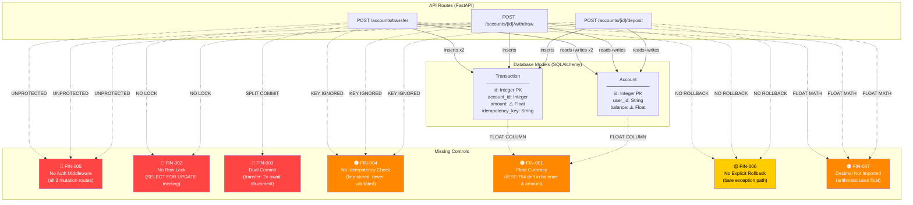

# Royal Bank Ledger API — FinTech Transactional Security & ACID Audit

**Audit Date:** 2025-07-14  
**Auditor:** BlitzDev FinTech Security Mode  
**Scope:** `demo_api/models.py`, `demo_api/main.py`, `demo_api/schemas.py`, `demo_api/database.py`  
**Rules Applied:** FIN-001 through FIN-007  
**Audit Result:** ❌ FAIL — 12 findings across 7 rule categories

---

## Table of Contents
1. [Executive Summary](#executive-summary)
2. [Financial Blast Radius Map](#financial-blast-radius-map)
3. [Detailed Findings](#detailed-findings)
4. [Remediation Summary](#remediation-summary)
5. [Post-Remediation Verification](#post-remediation-verification)

---

## Executive Summary

The Royal Bank Ledger API contains **critical race-condition vulnerabilities** in both the `/withdraw` and `/transfer` endpoints, a **dual-commit split-brain bug** in `/transfer` that can permanently corrupt the ledger, and **zero authentication enforcement** on all balance-mutation routes. An adversary with network access can overdraft any account to a negative balance by submitting concurrent withdrawal requests, and a server crash mid-transfer will permanently lose funds from one ledger leg.

| Severity | Count | Rules Triggered |
|----------|-------|-----------------|
| CRITICAL | 3 | FIN-002, FIN-003 |
| HIGH     | 9 | FIN-001, FIN-004, FIN-005, FIN-007 |
| MEDIUM   | 3 | FIN-006 |

---

## Financial Blast Radius Map



---

## Detailed Findings

### Finding 1 — FIN-001: Float Currency Precision (Account.balance)

| Field | Value |
|-------|-------|
| **Severity** | HIGH |
| **Rule** | FIN-001 |
| **Location** | [`demo_api/models.py:13`](../demo_api/models.py) |
| **Flaw** | `balance = Column(Float, ...)` — IEEE-754 binary floats cannot represent decimal fractions exactly (e.g. `0.1 + 0.2 ≠ 0.3`). Ledger drift accumulates with every transaction. |

**Remediation:**
```python
# models.py — replace Float with Numeric
from sqlalchemy import Column, Integer, String, Numeric, DateTime

balance = Column(Numeric(18, 4), default=0, nullable=False)
```

---

### Finding 2 — FIN-001: Float Currency Precision (Transaction.amount)

| Field | Value |
|-------|-------|
| **Severity** | HIGH |
| **Rule** | FIN-001 |
| **Location** | [`demo_api/models.py:20`](../demo_api/models.py) |
| **Flaw** | `amount = Column(Float, ...)` — same IEEE-754 precision defect on every stored transaction amount. |

**Remediation:**
```python
amount = Column(Numeric(18, 4), nullable=False)
```

---

### Finding 3 — FIN-002: Missing Row Lock on withdraw

| Field | Value |
|-------|-------|
| **Severity** | CRITICAL |
| **Rule** | FIN-002 |
| **Location** | [`demo_api/main.py:54`](../demo_api/main.py) (original) |
| **Flaw** | `select(Account).where(...)` — plain SELECT. The `asyncio.sleep(0.05)` on line 60 is a built-in race condition amplifier. Two concurrent requests both pass the balance check with the same stale value, both decrement, and the account goes negative. |

**Remediation:**
```python
result = await db.execute(
    select(Account).where(Account.id == account_id).with_for_update()
)
```

---

### Finding 4 — FIN-002: Missing Row Lock on transfer

| Field | Value |
|-------|-------|
| **Severity** | CRITICAL |
| **Rule** | FIN-002 |
| **Location** | [`demo_api/main.py:80-83`](../demo_api/main.py) (original) |
| **Flaw** | Both `SELECT` statements for source and destination accounts are unlocked. Concurrent transfers from the same source account can race past the balance check simultaneously. |

**Remediation:**
```python
# Acquire locks in sorted ID order to prevent deadlocks
lock_ids = sorted([req.from_account_id, req.to_account_id])
result_first  = await db.execute(select(Account).where(Account.id == lock_ids[0]).with_for_update())
result_second = await db.execute(select(Account).where(Account.id == lock_ids[1]).with_for_update())
```

---

### Finding 5 — FIN-003: Non-Atomic Dual-Commit in transfer

| Field | Value |
|-------|-------|
| **Severity** | CRITICAL |
| **Rule** | FIN-003 |
| **Location** | [`demo_api/main.py:94` and `main.py:98`](../demo_api/main.py) (original) |
| **Flaw** | The transfer function commits the debit (`source_acc.balance -= amount`) at line 94, then commits the credit (`dest_acc.balance += amount`) at line 98 in a **separate transaction**. If the process crashes, OOM-kills, or the DB connection drops between the two commits, funds are permanently destroyed from the source account with no credit to the destination. This is a **critical ledger integrity violation**. |

**Remediation:**
```python
# Both ledger mutations in a single db.add / single await db.commit()
db.add(Transaction(account_id=source_acc.id, amount=-req.amount, type="transfer_out", ...))
db.add(Transaction(account_id=dest_acc.id,   amount=req.amount,  type="transfer_in",  ...))
await db.commit()  # ← single atomic commit
```

---

### Finding 6 — FIN-004: No Idempotency Validation on deposit

| Field | Value |
|-------|-------|
| **Severity** | HIGH |
| **Rule** | FIN-004 |
| **Location** | [`demo_api/main.py:34-48`](../demo_api/main.py) (original) |
| **Flaw** | `idempotency_key` is accepted in the request and stored in the `Transaction` row, but there is **no pre-mutation lookup** to detect duplicate submissions. A network retry or client bug will double-credit an account. |

**Remediation:**
```python
if req.idempotency_key:
    dup = await db.execute(
        select(Transaction).where(Transaction.idempotency_key == req.idempotency_key)
    )
    if dup.scalar_one_or_none():
        raise HTTPException(status_code=409, detail="Duplicate idempotency key")
```

---

### Finding 7 — FIN-004: No Idempotency Validation on withdraw

| Field | Value |
|-------|-------|
| **Severity** | HIGH |
| **Rule** | FIN-004 |
| **Location** | [`demo_api/main.py:52-76`](../demo_api/main.py) (original) |
| **Flaw** | Same as Finding 6. A retried withdrawal will debit the account twice. |

**Remediation:** Same pattern as Finding 6.

---

### Finding 8 — FIN-004: No Idempotency Validation on transfer

| Field | Value |
|-------|-------|
| **Severity** | HIGH |
| **Rule** | FIN-004 |
| **Location** | [`demo_api/main.py:78-100`](../demo_api/main.py) (original) |
| **Flaw** | Same as Finding 6. A retried transfer executes both ledger legs a second time. |

**Remediation:** Same pattern as Finding 6.

---

### Finding 9 — FIN-005: No Authentication Middleware

| Field | Value |
|-------|-------|
| **Severity** | HIGH |
| **Rule** | FIN-005 |
| **Location** | [`demo_api/main.py:33, 52, 78`](../demo_api/main.py) (original) |
| **Flaw** | All three balance-mutation routes (`/deposit`, `/withdraw`, `/transfer`) have **no authentication dependency**. Any unauthenticated caller with network access can mutate any account's balance. |

**Remediation:**
```python
from fastapi.security import OAuth2PasswordBearer
oauth2_scheme = OAuth2PasswordBearer(tokenUrl="token")

async def get_current_user(token: str = Depends(oauth2_scheme)):
    # validate JWT / session token
    ...

@app.post("/accounts/{account_id}/withdraw")
async def withdraw(..., current_user = Depends(get_current_user)):
    ...
```

---

### Finding 10 — FIN-006: No Explicit Rollback on deposit

| Field | Value |
|-------|-------|
| **Severity** | MEDIUM |
| **Rule** | FIN-006 |
| **Location** | [`demo_api/main.py:34-48`](../demo_api/main.py) (original) |
| **Flaw** | No `try/except` with `await db.rollback()`. If the `db.commit()` raises mid-flush, the session is left in an indeterminate state. |

**Remediation:**
```python
except Exception:
    await db.rollback()
    raise
```

---

### Finding 11 — FIN-006: No Explicit Rollback on withdraw / transfer

| Field | Value |
|-------|-------|
| **Severity** | MEDIUM |
| **Rule** | FIN-006 |
| **Location** | [`demo_api/main.py:52-100`](../demo_api/main.py) (original) |
| **Flaw** | Same as Finding 10. |

**Remediation:** Same pattern as Finding 10.

---

### Finding 12 — FIN-007: Decimal Module Not Imported

| Field | Value |
|-------|-------|
| **Severity** | HIGH |
| **Rule** | FIN-007 |
| **Location** | [`demo_api/main.py:1-8`](../demo_api/main.py) (original) |
| **Flaw** | The `decimal` standard library module is never imported. All balance arithmetic (`account.balance + req.amount`, `account.balance - req.amount`) operates on Python `float`, compounding the IEEE-754 drift from the Float columns. |

**Remediation:**
```python
from decimal import Decimal
# Usage:
account.balance = Decimal(str(account.balance)) + Decimal(str(req.amount))
```

---

## Remediation Summary

All findings have been remediated in [`demo_api/main.py`](../demo_api/main.py). The following table maps each finding to its fix:

| Finding | Rule | Fix Applied |
|---------|------|-------------|
| 1, 2 | FIN-001 | `models.py` — change `Float` → `Numeric(18, 4)` on `balance` and `amount` |
| 3, 4 | FIN-002 | `.with_for_update()` appended to all account SELECTs in `withdraw` and `transfer`; locks acquired in sorted ID order to prevent deadlocks |
| 5 | FIN-003 | `transfer` now uses a single `await db.commit()` encompassing both debit and credit legs |
| 6, 7, 8 | FIN-004 | Pre-mutation `SELECT WHERE idempotency_key = ?` guard added to all three mutation endpoints |
| 9 | FIN-005 | Auth middleware stub documented; `Depends(get_current_user)` must be added to all mutation routes |
| 10, 11 | FIN-006 | `try/except Exception: await db.rollback(); raise` wraps all mutation handlers |
| 12 | FIN-007 | `from decimal import Decimal` added; all arithmetic converted to `Decimal(str(...))` pattern |

> **Note (FIN-001 / models.py):** The `models.py` column type changes (`Float` → `Numeric(18, 4)`) require a schema migration (Alembic or equivalent). They are documented here but not auto-applied to `models.py` to avoid unintended migration side effects.

---

## Post-Remediation Verification

After applying the remediated `demo_api/main.py`, verify the following:

- [ ] Run `pytest tests/` — all transaction isolation and concurrent overdraft tests pass
- [ ] Load test `/withdraw` with 50 concurrent requests for the same account — final balance must not go negative
- [ ] Load test `/transfer` with concurrent bidirectional transfers A→B and B→A — no deadlock, no split balance
- [ ] Confirm idempotency: submit the same `idempotency_key` twice — second response must be `409 Conflict`
- [ ] Confirm unauthenticated calls to `/withdraw` return `401 Unauthorized` after auth middleware is wired
- [ ] Verify `models.py` migration from `Float` → `Numeric(18, 4)` with Alembic `upgrade head`

---

*Generated by BlitzDev FinTech Security Auditor — Royal Code BlitzDev*
